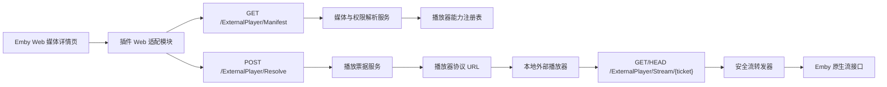

# Emby External Player Plugin 详细设计

> 文档状态：Draft 1  
> 设计日期：2026-08-12  
> 初始兼容目标：Emby Server 4.9.x，最低版本 4.9.1.80
> 目标框架：`netstandard2.1`  
> 部署形态：单个服务端 DLL，无浏览器扩展、无用户脚本管理器、无独立反向代理  
> 核心范围：Emby Web 媒体详情页外部播放器选择，不回传播放进度

## 1. 背景

Emby 官方插件 API 可以提供服务器启动入口、自定义 API、配置页面、元数据提供器等能力，但没有公开接口允许插件把自定义按钮插入媒体详情页的原生播放区域。

社区已经分别验证了以下能力：

- `Emby.CustomCssJS` 可以由服务端 DLL 在 Emby Web 启动链中加载额外 JavaScript。
- `StrmAssistant` 和 `MediaInfoKeeper` 可以由 DLL 提供或修改 Emby Web 模块，在运行时增加菜单命令和修改弹窗。
- `embyExternalUrl` 可以在媒体详情页识别当前媒体源、字幕和续播位置，并生成多种播放器协议链接。
- MoviePilot 的 `EmbyReverseProxy` 已实践“详情页按钮 + ExternalUrls 数据”的组合，但需要额外反向代理，超出本项目的轻量范围。

因此，本项目不尝试寻找不存在的官方详情页按钮接口，而是把非官方部分压缩为一个固定、只完成单一功能的 Web 适配模块。后端、配置、授权和媒体解析仍使用 Emby 插件能力完成。

## 2. 目标与非目标

### 2.1 目标

1. 管理员只需要把一个 DLL 放入 Emby 的插件目录并重启服务器。
2. Emby Web 的电影、剧集单集和普通视频详情页，在原生播放按钮旁显示一个“外部播放”按钮。
3. 点击按钮后弹出播放器列表，而不是在页面上平铺大量播放器按钮。
4. 支持选择媒体版本、外挂字幕以及是否从 Emby 记录的上次位置继续播放。
5. 支持按操作系统显示适合的播放器。
6. 插件配置使用 Emby Simple Plugin UI，避免维护自定义管理页面。
7. 不引入数据库、常驻外部服务或独立反向代理。
8. Web 注入失败时不影响 Emby 原生播放和其他页面。
9. 不在日志、页面 DOM 或持久化配置中暴露 Emby 访问令牌。

### 2.2 非目标

1. 不回传开始、暂停、拖动、停止或播放进度。
2. 不保证原生 Android TV、Apple TV、Roku 等客户端出现相同按钮。
3. 不修改或重新打包任何 Emby 客户端。
4. 不负责安装 PotPlayer、VLC、MPV handler 等客户端程序或协议处理器。
5. MVP 不支持 Live TV、录制中节目、ISO、蓝光菜单和需要 Emby 转码的场景。
6. MVP 不实现远程脚本市场、任意 JavaScript 执行或在线脚本更新。
7. 不绕过 Emby 的用户权限、媒体访问控制、授权机制或付费功能。

## 3. 关键设计决策

### 3.1 使用一个按钮和一个选择弹窗

媒体详情页只注入一枚“外部播放”按钮。弹窗中再展示可用播放器、媒体版本、字幕和续播选项。

这样做的理由：

- 页面只新增一个 DOM 节点，升级适配成本更低。
- 手机和窄屏布局不会被十几个播放器按钮撑开。
- 播放器配置、能力提示和错误信息有稳定的呈现位置。
- 后续增加播放器不需要继续改变详情页布局。

### 3.2 Web 模块由插件提供，不允许任意脚本

插件 DLL 内嵌固定的 `external-player.js` 和 `external-player.css`。浏览器只能加载插件编译时携带的资源，管理员不能在配置页输入任意 JavaScript。

这与通用的 CustomCssJS 管理器不同，可显著缩小 XSS 和误配置风险。

### 3.3 只注入加载器，不整体替换 Emby Web 文件

推荐的加载方式如下：

1. 插件实现 `IServerEntryPoint`。
2. 启动时定位 `ApplicationResourcesPath/dashboard-ui/app.js`。
3. 在已验证的模块加载锚点附近插入一条带唯一标记的加载语句。
4. 该语句加载插件独有路径：`/{webRoot}/modules/embyexternalplayer/plugin.js`。
5. 该独有路径由插件 `IService` 返回 DLL 内嵌的固定 JavaScript。

只修改一条加载语句，不复制或替换完整 `app.js`，也不复用 `StrmAssistant`、`MediaInfoKeeper` 使用的 `/modules/shortcuts.js` 路由。

选择该方案是为了避免：

- 多个插件同时接管 `shortcuts.js` 导致路由冲突。
- 把完整 Emby Web 模块固化在插件里，服务器升级后继续返回旧代码。
- 把脚本文件散落到 Emby 安装目录。

### 3.4 后端与 Web 适配层分离

Web 模块只负责：

- 识别当前详情页。
- 插入按钮和弹窗。
- 收集用户选择。
- 调用插件 API。
- 在用户点击行为中打开后端返回的播放器协议 URL。

所有媒体权限检查、票据签发、URL 构造和播放器能力规则由 C# 后端完成。

### 3.5 ExternalUrls 不作为 MVP 的可靠依赖

`IExternalId` 只能根据条目的 Provider ID 和静态 `UrlFormatString` 生成链接，缺少当前用户、访问令牌、当前媒体版本和当前字幕上下文。为了让它出现在既有条目上，还需要写入 Provider ID 或触发元数据刷新。

因此：

- MVP 以 Emby Web 按钮为唯一承诺的交互入口。
- Phase 3 可以实验性增加 `ExternalUrls` 落地页链接。
- 不使用把长期 `api_key` 写进 `ExternalUrls` 的默认实现。
- 不向用户承诺原生客户端都能展示或打开该链接。

这是对“全客户端兼容”与“纯 DLL、轻量、安全”之间的明确取舍。

## 4. 总体架构



组件职责：

| 组件 | 职责 |
|---|---|
| `Plugin` | 插件元数据、配置和卸载生命周期 |
| `PluginEntryPoint` | 启动加载器注入、兼容性检查和状态记录 |
| `DashboardBootstrapInstaller` | 幂等修改或移除唯一加载语句 |
| `WebResourceService` | 返回内嵌的 JS、CSS 和图标资源 |
| `ExternalPlayerApiService` | 对 Web 前端提供媒体清单与播放解析 API |
| `MediaManifestService` | 读取媒体源、字幕、用户续播位置并执行权限检查 |
| `PlayerAdapterRegistry` | 管理各播放器的协议、平台和能力 |
| `LaunchTicketStore` | 管理内存中的短期随机播放票据 |
| `StreamRelayService` | 用票据和已授权本地路径提供 Range/HEAD 文件流 |
| `ExternalUrlProvider` | Phase 3 可选的 ExternalUrls 实验实现 |

## 5. 建议的代码目录

正式进入实现阶段后，项目建议扩展为：

```text
Emby.ExternalPlayer.sln
src/
  Emby.ExternalPlayer/
    Emby.ExternalPlayer.csproj
    Plugin.cs
    PluginOptions.cs
    PluginEntryPoint.cs
    Api/
      ExternalPlayerRequests.cs
      ExternalPlayerApiService.cs
      WebResourceRequests.cs
      WebResourceService.cs
      StreamRequests.cs
      StreamRelayService.cs
    Domain/
      MediaManifest.cs
      PlayerDescriptor.cs
      LaunchRequest.cs
      LaunchResolution.cs
      LaunchTicket.cs
    Services/
      MediaManifestService.cs
      PlayerAdapterRegistry.cs
      LaunchUrlService.cs
      LaunchTicketStore.cs
      TicketCleanupPolicy.cs
    Web/
      DashboardBootstrapInstaller.cs
      DashboardPatchState.cs
      SelectorProfiles.cs
    Resources/
      external-player.js
      external-player.css
      icons/
    Properties/
      launchSettings.json
    ThumbImage.png
tests/
  Emby.ExternalPlayer.Tests/
    DashboardBootstrapInstallerTests.cs
    LaunchTicketStoreTests.cs
    PlayerAdapterTests.cs
    ResolveRequestValidationTests.cs
    StreamRangeTests.cs
docs/
  DESIGN.md
```

初始工程基于 Emby SDK 的 Minimal Plugin 或 Simple UI Plugin 模板，但目标框架统一调整为 `netstandard2.1`。官方模板当前仍使用 `netstandard2.0`，本项目选择 2.1 是为了与本机现有 Emby 插件和现代 Emby 4.9.x 宿主保持一致。该选择不以旧 .NET Framework、UWP 或不支持 .NET Standard 2.1 的宿主为兼容目标。

`MediaBrowser.Server.Core` 包版本必须与实际目标服务器兼容并固定，不应简单假设 SDK 仓库发布号等于 NuGet 包版本。Emby 4.9.1.80 不会把插件对 4.9.1.90 程序集的强版本引用向下绑定，因此项目固定以最低支持版本 4.9.1.80 编译，并在更高服务器版本做向上兼容回归。Emby 依赖包即使只提供 `netstandard2.0` 程序集，也可以由本项目的 `netstandard2.1` 目标正常引用。

## 6. 插件配置设计

使用 `BasePluginSimpleUI<PluginOptions>`，避免自定义管理 HTML。

建议配置项：

| 配置项 | 类型 | 默认值 | 说明 |
|---|---:|---:|---|
| `Enabled` | bool | true | 插件总开关 |
| `EnableWebButton` | bool | true | 是否启用详情页按钮 |
| `ButtonText` | string | 外部播放 | 按钮显示文本 |
| `ButtonPlacement` | enum | AfterPrimaryPlay | 播放按钮后或动作区末尾 |
| `ShowOnlyPlatformPlayers` | bool | true | 默认隐藏明显不属于当前平台的播放器 |
| `ResumeByDefault` | bool | true | 默认使用 Emby 续播位置 |
| `StreamMode` | enum | SecureTicketRelay | 安全票据转发或显式兼容模式 |
| `TicketLifetimeMinutes` | int | 480 | 票据绝对有效期，限制在 30 至 720 分钟 |
| `EnablePotPlayer` | bool | true | Windows PotPlayer |
| `EnableIina` | bool | true | macOS IINA |
| `EnableVlc` | bool | true | VLC |
| `EnableInfuse` | bool | true | Apple 平台 Infuse |
| `EnableMpv` | bool | false | 需要相应 URL handler 时再开启 |
| `EnableNPlayer` | bool | false | nPlayer |
| `DefaultPlayerWindows` | enum | PotPlayer | Windows 默认播放器 |
| `DefaultPlayerMacOS` | enum | IINA | macOS 默认播放器 |
| `DefaultPlayerIOS` | enum | Infuse | iOS 默认播放器 |
| `DefaultPlayerAndroid` | enum | VLC | Android 默认播放器 |
| `DebugLogging` | bool | false | 不记录令牌和完整播放 URL |

配置校验规则：

- 票据有效期必须在允许范围内。
- 默认播放器必须已启用，否则保存时自动回退或报校验错误。
- `LegacyTokenUrl` 模式必须显示明确的令牌泄露风险提示。
- 禁止管理员填写任意协议模板或 JavaScript；播放器适配器由代码内置。

## 7. Web 加载与注入设计

### 7.1 加载器注入

`DashboardBootstrapInstaller` 执行以下步骤：

1. 获取 Emby 的 `dashboard-ui/app.js` 绝对路径。
2. 读取文件并搜索受支持版本的锚点。
3. 如果已存在插件唯一标记，直接返回成功。
4. 如果找到锚点，插入唯一加载语句。
5. 在同目录创建临时文件并原子替换，避免写到一半导致 Web 无法启动。
6. 保存注入前后的 SHA-256、Emby 版本、注入时间和结果到插件数据目录。
7. 如果文件只读、锚点不存在或哈希状态异常，只记录错误并禁用 Web 增强，不影响服务器启动。

加载语句需要带固定标记，例如：

```text
/* Emby.ExternalPlayer bootstrap: 6f784f38 */
```

卸载时只删除完全匹配的注入片段。若文件已经被第三方修改且无法确定安全边界，则不自动恢复，记录管理员可操作提示。

### 7.2 为什么不覆盖 shortcuts.js

`StrmAssistant` 和 `MediaInfoKeeper` 已经使用 `/modules/shortcuts.js` 进行扩展。如果本插件注册同一路由，Emby 的服务路由选择可能产生冲突。

本插件只新增自己的资源路由：

```text
/{webRoot}/modules/embyexternalplayer/plugin.js
/{webRoot}/modules/embyexternalplayer/plugin.css
```

核心文件只负责加载这个唯一模块。

### 7.3 页面识别

Web 模块优先使用 Emby 页面事件，DOM 观察只作为后备：

1. 监听 `viewbeforeshow` 和 `viewshow`。
2. 从 URL hash 或页面上下文提取 `itemId`。
3. 检查是否存在可见的媒体详情根节点。
4. 检查条目是否为 Movie、Episode 或 Video。
5. 如果页面异步渲染未完成，使用有时限的 `MutationObserver` 等待动作区出现。
6. 插入完成或超时后立即停止观察，避免永久监听整个文档树。

不允许无限运行的全局 MutationObserver。

### 7.4 按钮定位

采用多级定位策略：

1. 找到当前可见详情页中的 `.mainDetailButtons`。
2. 在动作区内按优先级查找“播放/继续播放”按钮。
3. 找到时插入到最后一个主要播放动作之后。
4. 找不到具体播放按钮但动作区存在时，追加到动作区末尾。
5. 动作区也不存在时放弃注入，不创建漂浮按钮。

插件节点必须包含：

```html
data-emby-external-player="true"
data-item-id="..."
```

每次页面事件触发时，先按 `itemId` 检查并去重。页面切换后移除旧条目的残留节点。

### 7.5 弹窗

弹窗使用插件自己的命名空间、CSS 和可访问性逻辑，不依赖 Emby 未公开的对话框模块。

弹窗内容：

- 当前媒体标题。
- 媒体版本选择。
- 外挂字幕选择，包括“不加载字幕”。
- “从上次位置继续”开关和格式化时间。
- 按平台过滤后的播放器列表。
- 每个播放器的能力提示，如“不支持传入字幕”或“需要安装协议处理器”。
- 错误提示和再次尝试按钮。

所有来自媒体元数据的文本只能通过 `textContent` 写入 DOM，禁止拼接为 HTML。

### 7.6 自定义协议打开

播放器按钮的点击流程：

1. 在真实用户点击事件中调用 `/Resolve`。
2. 得到 `launchUrl` 后调用 `window.location.assign(launchUrl)`。
3. 如果浏览器因异步请求丢失用户激活状态而阻止自定义协议，显示一个真实的 `<a href="custom-scheme:...">打开播放器</a>` 供用户再次点击。
4. 不自动循环尝试多个协议，避免浏览器反复弹窗。

## 8. API 设计

### 8.1 获取插件状态

```http
GET /ExternalPlayer/Status
```

用途：管理员诊断加载器状态。

权限：仅管理员。

响应示例：

```json
{
  "pluginVersion": "0.1.0",
  "embyVersion": "4.9.5.0",
  "backendReady": true,
  "webIntegrationReady": true,
  "dashboardWritable": true,
  "bootstrapMarkerFound": true,
  "selectorProfile": "emby-web-4.9",
  "lastError": null
}
```

### 8.2 获取媒体与播放器清单

```http
GET /ExternalPlayer/Manifest?itemId={itemId}
```

权限：已登录用户。

服务端必须从请求认证上下文确定用户，不信任前端提交的 `userId`。

响应示例：

```json
{
  "itemId": "12345",
  "title": "Example Movie",
  "resumePositionMs": 1350000,
  "mediaSources": [
    {
      "id": "source-1",
      "name": "4K REMUX",
      "container": "mkv",
      "displayTitle": "2160p HEVC HDR",
      "isRemote": false,
      "subtitles": [
        {
          "index": 3,
          "displayTitle": "Chinese Simplified ASS",
          "codec": "ass",
          "isExternal": true
        }
      ]
    }
  ],
  "players": [
    {
      "id": "potplayer",
      "name": "PotPlayer",
      "platforms": ["windows"],
      "supportsSubtitleUrl": true,
      "supportsStartPosition": true,
      "requiresProtocolHandler": true
    }
  ],
  "defaults": {
    "mediaSourceId": "source-1",
    "subtitleIndex": 3,
    "resume": true,
    "playerId": "potplayer"
  }
}
```

校验：

- 条目存在且属于支持类型。
- 当前认证用户对条目有访问权限。
- 只返回用户可访问的媒体源。
- 不返回服务器物理路径、Emby token 或上游凭据。

### 8.3 解析播放器链接

```http
POST /ExternalPlayer/Resolve
Content-Type: application/json
```

权限：已登录用户。

请求示例：

```json
{
  "itemId": "12345",
  "mediaSourceId": "source-1",
  "subtitleIndex": 3,
  "playerId": "potplayer",
  "platform": "windows",
  "resume": true
}
```

响应示例：

```json
{
  "launchUrl": "potplayer://https://emby.example.com/ExternalPlayer/Stream/... /current /seek=120 /sub=https://emby.example.com/ExternalPlayer/Subtitle/...",
  "ticketExpiresAt": "2026-08-11T18:00:00Z",
  "warnings": []
}
```

服务端必须重新校验：

- 用户和条目权限。
- `mediaSourceId` 确实属于该条目。
- `subtitleIndex` 确实属于该媒体源且允许交付。
- `playerId` 已启用且属于内置适配器。
- `platform` 只能作为显示和协议选择提示，不能作为安全依据。
- 续播位置以服务端 UserData 为准，不能接受任意前端时间覆盖。

### 8.4 流媒体票据入口

```http
GET  /ExternalPlayer/Stream/{ticket}/stream.js
HEAD /ExternalPlayer/Stream/{ticket}/stream.js
```

该接口不要求额外 Emby header，因为随机票据本身就是短期 Bearer 凭证。

必须支持：

- `GET` 和 `HEAD`。
- 单 Range 请求和 `206 Partial Content`。
- 由 Emby `IHttpResultFactory` 处理 `Range`、`If-Range`、`If-None-Match`、`If-Modified-Since`。
- 保留必要响应头：`Content-Type`、`Content-Length`、`Content-Range`、`Accept-Ranges`、`ETag`、`Last-Modified`、`Content-Disposition`。
- 直接从 Resolve 阶段已验证的本地媒体文件流式读取，单连接缓冲 64 KB，禁止把完整视频加载到内存。
- 客户端断开时由请求取消令牌和 Emby 响应管线终止读取。
- 不向任何 URL 发起回源请求，票据中不保存 Emby token。

路由末尾的固定 `.js` 是有意的日志保护措施：Emby 4.9.x 核心会记录普通媒体请求路径，
但会跳过静态扩展请求的详细记录。响应仍返回真实的视频 `Content-Type` 和安全文件名。
这避免原始 Bearer 票据进入 Emby 核心日志，不改变传输内容。

### 8.5 字幕票据入口

```http
GET /ExternalPlayer/Subtitle/{ticket}/{subtitleIndex}/subtitle.css
```

字幕必须绑定在同一条播放票据上，不能仅凭条目 ID 下载。服务端重新确认字幕索引属于票据中的媒体源。

## 9. 播放票据设计

### 9.1 票据形态

使用 256 位加密安全随机数作为不透明 token。客户端看不到内部字段，服务端以内存字典保存票据信息。

`LaunchTicket` 至少包含：

```text
TokenHash
UserId
ItemId
MediaSourceId
SubtitleIndex
LocalMediaFilePath
LocalSubtitleFilePath
ContentLength
CreatedAtUtc
ExpiresAtUtc
LastAccessAtUtc
```

当前实现不调用本机 Emby HTTP 接口，也不在票据中保存用户访问令牌。媒体与字幕物理路径只存在服务端内存中的票据载荷，绝不返回前端或写入日志。

### 9.2 生命周期

- 默认绝对有效期 8 小时。
- 配置范围 30 分钟至 12 小时。
- 票据允许重复 Range 请求，不能设置为一次性。
- 不采用无限滑动续期。
- 服务端重启后全部票据失效，这是可接受行为。
- 内存中最多保留 2000 个票据，超限时优先淘汰过期和最早创建的票据。
- 创建票据和固定请求计数时执行惰性清理，不需要后台定时任务。

### 9.3 风险

票据在有效期内被复制，持有者就能访问对应媒体。因此：

- 全链路必须使用 HTTPS。
- 不把票据写入日志、分析平台或错误上报。
- 响应使用 `Cache-Control: no-store`。
- 不在 Referer 中跳转到第三方 HTTP 页面。
- 不默认绑定 IP，因为浏览器和播放器可能经过不同网络路径；可在未来增加管理员可选策略。

## 10. 流模式

### 10.1 SecureTicketRelay

稳定版本的默认模式。

优点：

- 外部播放器 URL 不包含 Emby 长期访问令牌。
- 票据只授权一个用户、一个条目和一个媒体源。
- 可以设置有效期和容量限制。

代价：

- 插件需要正确实现 Range/HEAD 流式文件读取。
- 所有外部播放流量会经过插件的轻量转发层。
- 当前仅支持 Emby 可直接访问的本地 `File` 媒体源；远程 STRM、HLS 和特殊媒体源需显式使用高风险的 `LegacyTokenUrl` 兼容模式。

### 10.2 LegacyTokenUrl

只作为兼容和诊断模式，默认关闭。

它直接生成 Emby 原生 stream URL，并把当前用户 token 放在查询参数中。这与多个社区脚本的做法一致，代码更少、兼容性更高，但 token 会出现在播放器历史、代理日志或剪贴板中。

启用时必须在配置页面显示风险警告；插件自身仍不得记录完整 URL。

## 11. 播放器适配器

每个播放器由固定的 C# 适配器实现，不使用管理员自定义字符串模板。

统一接口建议：

```csharp
public interface IPlayerAdapter
{
    string Id { get; }
    string DisplayName { get; }
    IReadOnlyCollection<ClientPlatform> Platforms { get; }
    PlayerCapabilities Capabilities { get; }
    string BuildLaunchUrl(PlayerLaunchContext context);
}
```

`PlayerLaunchContext` 包含：

- 已签名的流媒体 URL。
- 可选字幕 URL。
- 服务端确定的续播毫秒数。
- 安全处理后的标题和文件名。
- 客户端平台提示。

MVP 建议顺序：

| 播放器 | 平台 | MVP | 备注 |
|---|---|---:|---|
| PotPlayer | Windows | 是 | 协议参数和 Chrome 新版本行为需重点测试 |
| IINA | macOS | 是 | 使用 `iina://` URL scheme |
| VLC | Windows/macOS/iOS/Android | 是 | 不同平台协议格式不同 |
| Infuse | iOS/iPadOS/macOS | 是 | 使用 x-callback-url，字幕能力按版本测试 |
| MPV | Windows/macOS/Linux | Phase 2 | 桌面端通常需要额外 handler |
| nPlayer | Apple/移动端 | Phase 2 | 不同平台 scheme 不同 |

所有 URL 参数必须按播放器协议分别编码，不能对整个 URL 重复执行统一编码。

能力字段至少包括：

```text
SupportsSubtitleUrl
SupportsStartPosition
SupportsTitle
RequiresProtocolHandler
SupportsHttp
SupportsHttps
```

前端只能根据能力显示提示，最终 URL 由服务端适配器生成。

## 12. 媒体与续播处理

### 12.1 媒体类型

MVP 支持：

- Movie
- Episode
- Video

后续评估：

- Audio
- MusicVideo
- Live TV
- Recording

### 12.2 媒体版本

Manifest 返回每个 MediaSource 的稳定 ID、名称、容器和显示信息，不返回物理路径。

前端默认值按以下顺序选择：

1. 如果详情页已有可见的 `select.selectSource` 且值有效，使用当前页面选择。
2. 否则使用 Emby 返回的默认媒体源。
3. 仍无法确定时使用第一个可播放媒体源。

Resolve 阶段必须再次验证该媒体源属于当前条目。

### 12.3 字幕

MVP 只传递外挂字幕 URL。内封字幕由外部播放器从容器中自行选择。

默认字幕按以下顺序：

1. 当前详情页已经选择的外挂字幕。
2. Emby 标记的默认外挂字幕。
3. 用户语言匹配的外挂字幕。
4. 不加载字幕。

字幕协议不支持或播放器能力未知时，前端应显示提示，而不是静默声称已加载。

### 12.4 续播

续播位置来自当前用户的 `UserData.PlaybackPositionTicks`，转换为毫秒后交给播放器适配器。

规则：

- 小于 10 秒时按从头播放处理。
- 距离媒体结束不足配置阈值时按从头播放处理。
- 播放器不支持起始位置时仍可播放，但返回 warning。
- 不根据外部播放器启动行为修改 Emby UserData。

## 13. 鉴权与安全

### 13.1 信任边界

浏览器提交的以下字段全部不可信：

- `userId`
- `itemId`
- `mediaSourceId`
- `subtitleIndex`
- `playerId`
- `platform`
- `resume`

后端从 Emby 认证上下文确定用户，并逐项验证资源关系。

### 13.2 API 权限

- Manifest 和 Resolve：`[Authenticated]`。
- Status 和配置：管理员权限。
- JS/CSS 静态资源：可匿名获取，但内容固定且不含配置秘密。
- Stream 和 Subtitle：使用高熵短期票据认证。

### 13.3 前端安全

- 禁止 `eval`、`new Function` 和任意远程脚本。
- 禁止从 CDN 加载播放器图标；图标内嵌在 DLL。
- 所有媒体文本通过 `textContent` 渲染。
- 不使用媒体标题拼接 CSS selector。
- 所有全局变量使用唯一命名空间。
- CSS 选择器以插件根节点开头，避免污染 Emby 页面。

### 13.4 日志脱敏

日志允许包含：

- 条目 ID。
- 媒体源 ID 的短哈希。
- 播放器 ID。
- HTTP 状态码。
- 兼容性检测结果。

日志禁止包含：

- Emby token。
- 播放票据原文。
- 完整 stream URL。
- 上游带签名的 STRM URL。
- 服务器文件系统路径，除非管理员显式开启诊断且日志仍做必要脱敏。

## 14. 兼容性策略

### 14.1 支持范围

首个版本只承诺：

- Emby Server 4.9.x。
- 由该服务器提供的 Emby Web。
- Chromium、Firefox 和 Safari 的近期版本。
- 反向代理下的 HTTP base path 和 HTTPS 场景。

不承诺：

- 不加载服务器 `dashboard-ui` 的原生客户端。
- 第三方 Emby 客户端。
- 老 Android TV 客户端。
- 所有播放器的所有历史版本。

### 14.2 Selector Profile

DOM selector 集中维护，禁止散落在业务代码中：

```text
SelectorProfile
  DetailRoot
  MainDetailButtons
  PrimaryPlayButtons[]
  MediaSourceSelect
  SubtitleSelect
```

运行时按服务器大版本选择 profile。若探针失败，按钮不显示并在 Status 中报告，不尝试猜测性修改页面。

### 14.3 Emby 升级

服务器升级后通常会替换 `app.js`。插件在下次启动时重新执行幂等检查：

- 新文件仍有已知锚点：重新注入。
- 锚点变化：保持原文件不动，WebIntegrationReady=false。
- 不对未知压缩代码做模糊正则替换。

每个受支持的 Emby Web 构建都需要在兼容矩阵中记录：

| Emby 版本 | app.js 锚点 | 详情页 selector | Chrome | Firefox | Safari | 结果 |
|---|---|---|---|---|---|---|
| 4.9.1.80 | `Promise.all(list.map(loadPlugin))` | 自动化 DOM 夹具通过 | DOM 夹具 | DOM 夹具 | DOM 夹具 | 插件、配置 UI、HEAD/Range、字幕通过 |
| 4.9.3.0 | `Promise.all(list.map(loadPlugin))` | 自动化 DOM 夹具通过 | DOM 夹具 | DOM 夹具 | DOM 夹具 | 插件、配置 UI、HEAD/Range、字幕通过 |
| 4.9.5.0 | `Promise.all(list.map(loadPlugin))` | 自动化 DOM 夹具通过 | DOM 夹具 | DOM 夹具 | DOM 夹具 | 插件、配置 UI、HEAD/Range、字幕通过 |

## 15. 故障处理

| 故障 | 处理 |
|---|---|
| dashboard-ui 不可写 | 后端继续加载，禁用 Web 按钮并在 Status 提示 |
| app.js 锚点不存在 | 不修改文件，记录兼容性错误 |
| 插件 JS 加载失败 | 不影响 Emby 原生 UI；浏览器控制台只输出一条带前缀的错误 |
| Manifest API 失败 | 弹窗显示错误，不生成协议链接 |
| 自定义协议未注册 | 显示安装/配置提示，允许复制安全流 URL |
| 票据过期 | Stream 返回 401/410，不重定向到登录页 |
| 媒体权限变化 | 下一次票据访问失败并撤销票据 |
| Range 读取失败 | 返回可诊断状态，禁止静默降级为整文件缓冲 |
| 外部播放器不支持字幕 | 正常播放并显示 warning |

## 16. 性能约束

- DLL 目标体积尽量小于 1 MB，不包含大型第三方框架。
- 内嵌 JS + CSS 目标小于 80 KB，发布时可压缩但保留源码映射不是必需。
- Manifest 正常响应目标小于 150 ms，不进行文件探测或网络探测。
- Resolve 正常响应目标小于 100 ms。
- StreamRelay 必须使用流式 IO 和有界缓冲，单连接建议缓冲不超过 256 KB。
- 不使用全局永久 MutationObserver。
- 不创建后台轮询线程。
- 票据存储使用有界内存集合。

## 17. 测试方案

### 17.1 单元测试

必须覆盖：

- 加载器首次注入。
- 重复启动不会重复注入。
- 锚点不存在时不修改原文件。
- 卸载只移除自己的标记片段。
- 不同播放器 URL 的编码、标题、字幕和续播参数。
- 无效 item、source、subtitle、player 的拒绝逻辑。
- 票据创建、过期、容量淘汰和并发读取。
- 日志脱敏。
- Range/HEAD 响应长度、状态码和边界。
- 文件名安全化和 header 注入防护。

### 17.2 集成测试

在隔离的 Emby 测试实例中验证：

1. DLL 加载、配置页显示和卸载。
2. `/Manifest` 与 `/Resolve` 的真实认证和权限。
3. 普通 MKV/MP4 的完整请求、HEAD 和 Range 请求。
4. 播放器拖动导致的多个非连续 Range 请求。
5. 外挂 SRT、ASS 字幕。
6. 多版本电影。
7. 中文、空格、引号、emoji 标题。
8. 反向代理 base path。
9. HTTP 与 HTTPS。
10. 服务器重启后的票据失效行为。

### 17.3 Web 端到端测试

- 进入电影详情页后按钮只出现一次。
- 从电影切换到单集时按钮绑定新的 itemId。
- 浏览器后退/前进不会残留旧按钮。
- 窄屏下按钮和弹窗可用。
- 无媒体源或无权限时不显示按钮。
- 选择不同媒体版本后 Resolve 请求正确。
- 弹窗键盘焦点、Escape 关闭和屏幕阅读器标签正确。
- 自定义协议被拦截时出现手动打开链接。

### 17.4 播放器人工矩阵

每个播放器至少测试：

- 纯 URL 播放。
- 带中文文件名。
- HTTPS 证书有效/无效时的表现。
- 外挂字幕。
- 续播位置。
- 服务器位于反向代理之后。

## 18. 验收标准

### 18.1 Phase 0 兼容性探针

- 单 DLL 能被目标 Emby Server 加载。
- 独有 Web 资源路由能够返回 JS。
- 加载器注入可重复执行且不重复写入。
- 详情页可以稳定插入一个测试按钮。
- 卸载或禁用后能够安全停止加载插件模块。

### 18.2 MVP

- 用户不安装浏览器扩展或用户脚本。
- 电影、单集和普通视频详情页显示一个外部播放按钮。
- 弹窗至少支持 PotPlayer、IINA、VLC、Infuse。
- 支持媒体版本、外挂字幕和 Emby 续播位置。
- 能通过至少一个 Windows 播放器和一个 macOS/iOS 播放器打开媒体。
- 插件不写数据库、不运行进度回传任务。
- Web 适配失败不影响原生播放。
- 日志中没有 token、票据和完整播放 URL。

### 18.3 稳定版本

- `SecureTicketRelay` 支持 HEAD 和 Range。
- 兼容目标 Emby 4.9.x 的至少两个维护版本。
- 升级 Emby 后锚点不匹配时安全失败。
- 完成威胁模型检查和令牌泄露检查。
- 提供明确的客户端 URL handler 安装说明，但插件不自动安装客户端组件。

## 19. 实施阶段与工作量

### Phase 0：兼容性探针，约 1 天

- 从官方 SDK 模板建立最小插件。
- 验证目标服务器的程序集版本和依赖。
- 提供唯一 JS 资源路由。
- 验证 app.js 加载器锚点和按钮 selector。
- 验证一个播放器协议。

如果该阶段失败，应停止完整实现，先确认 Emby 版本、文件权限或客户端类型。

### Phase 1：交互 MVP，约 2 至 4 天

- Simple UI 配置。
- Manifest/Resolve API。
- 单按钮、选择弹窗和页面生命周期处理。
- PotPlayer、IINA、VLC、Infuse 适配器。
- 多媒体版本、字幕、续播。
- 受限的 `LegacyTokenUrl` 仅用于测试兼容性。

### Phase 2：安全稳定版，约 3 至 5 天

- 内存播放票据。
- Stream/Subtitle relay。
- HEAD、Range、取消和响应头处理。
- 完整日志脱敏与安全测试。
- MPV、nPlayer 可选支持。

### Phase 3：兼容扩展，约 2 至 5 天

- ExternalUrls 实验入口。
- 更多 Emby 4.9.x selector profile。
- STRM、远程媒体源和更多播放器测试。
- 完善诊断页和安装文档。

总体预计：完成可用 MVP 约 3 至 5 天；达到适合长期部署的安全稳定版约 1 至 2 周。

## 20. 开发前必须确认的事项

在开始写实现代码前，需要在实际部署环境中确认：

1. 精确的 Emby Server 版本。
2. Linux 原生安装还是 Docker，以及 `dashboard-ui/app.js` 是否可写。
3. Emby 是否运行在反向代理和 base path 下。
4. 优先支持的客户端操作系统。
5. 第一优先播放器。
6. 是否接受稳定版前的测试构建使用 `LegacyTokenUrl`。
7. 是否已安装 StrmAssistant、MediaInfoKeeper 或 CustomCssJS 等 UI 增强插件。

这些信息不会改变总体架构，但会决定 Phase 0 的验证组合。

## 21. 已知风险与取舍

| 风险 | 概率 | 影响 | 缓解 |
|---|---:|---:|---|
| Emby Web 改变加载锚点 | 中 | Web 按钮消失 | 精确版本 profile、安全失败、快速兼容发布 |
| 详情页 DOM 类名改变 | 中 | 按钮无法定位 | selector 集中维护、运行时探针 |
| dashboard-ui 只读 | 中 | 无法自动加载模块 | Status 提示、部署文档、可写挂载；不偷偷扩大权限 |
| 浏览器阻止自定义协议 | 中 | 无法自动拉起播放器 | 二次显式链接和安装提示 |
| 播放器协议版本差异 | 中 | 参数失效 | 每播放器独立适配器和人工矩阵 |
| 票据泄露 | 低至中 | 临时媒体访问 | HTTPS、短期、单媒体绑定、禁止日志 |
| Range 文件流实现缺陷 | 中 | 无法拖动或高内存 | 集成测试、有界流、稳定版前不默认启用 |
| 与其他 UI 插件冲突 | 低至中 | Web 资源加载失败 | 唯一资源路由，不接管 shortcuts.js，唯一 DOM 命名空间 |

## 22. 参考资料

### Emby 官方

- [Server Plugins](https://dev.emby.media/doc/plugins/index.html)
- [Plugin Development](https://dev.emby.media/doc/plugins/dev/index.html)
- [Automatic Type Discovery](https://dev.emby.media/doc/plugins/dev/Automatic-Type-Discovery.html)
- [Creating API Endpoints](https://dev.emby.media/doc/plugins/dev/Creating-Api-Endpoints.html)
- [Creating UI for Plugins](https://dev.emby.media/doc/plugins/ui/index.html)
- [Simple Plugin UI](https://dev.emby.media/doc/plugins/ui/simpleui.html)
- [Emby SDK](https://github.com/MediaBrowser/Emby.SDK)
- [Official Minimal Plugin Template](https://github.com/MediaBrowser/Emby.SDK/tree/master/SampleCode/Templates/EmbyPluginMinimalTemplate)
- [Official Simple UI Plugin Template](https://github.com/MediaBrowser/Emby.SDK/tree/master/SampleCode/Templates/EmbyPluginSimpleUiTemplate)

### 社区实现参考

- [Shurelol/Emby.CustomCssJS](https://github.com/Shurelol/Emby.CustomCssJS)
- [bpking1/embyExternalUrl](https://github.com/bpking1/embyExternalUrl)
- [sjtuross/StrmAssistant](https://github.com/sjtuross/StrmAssistant)
- [honue/MediaInfoKeeper](https://github.com/honue/MediaInfoKeeper)
- [chen3861229/dd-danmaku](https://github.com/chen3861229/dd-danmaku)
- [DDSRem-Dev/MoviePilot-Plugins 的 EmbyReverseProxy](https://github.com/DDSRem-Dev/MoviePilot-Plugins/tree/main/plugins.v2/embyreverseproxy)

参考这些项目时只复用经过验证的架构思想。正式实现前必须分别检查许可证，不直接复制不兼容许可证下的源代码。
